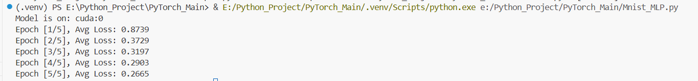

# Mnist-MLP
MNIST classification using PyTorch MLP
这是我学习Pytorch的一个小项目，使用MLP（多层感知机）对MNIST手写数据进行分类。这是我理解深度学习训练流程的起点。

## 功能说明
- 使用 `torchvision.datasets.MNIST` 加载数据
- 构建一个两层 MLP 模型（784 → 128 → 10）
- 使用交叉熵损失函数和 SGD 优化器训练
- 训练 5 个 epoch，打印平均 loss

## 使用方法
```bash
python Mnist_MLP.py


